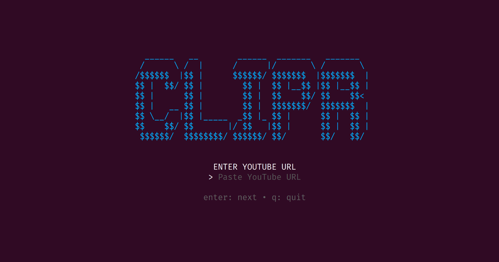

# 🎬 clipr



**clipr** is a lightweight, high-performance Terminal User Interface (TUI) tool written in Go. It allows you to download specific segments of YouTube videos as MP4 files without needing to download the entire video. 

By leveraging `yt-dlp`'s section-streaming capabilities, **clipr** fetches only the byte ranges needed for your specified timestamp, saving bandwidth and time.

---

## 🛠 Tools Used

* **[Go (Golang)](https://go.dev/):** The core programming language for the application logic and concurrency.
* **[Bubble Tea](https://github.com/charmbracelet/bubbletea):** A Go framework based on the Elm architecture used to build the interactive TUI.
* **[yt-dlp](https://github.com/yt-dlp/yt-dlp):** A powerful command-line video downloader that handles the streaming and extraction logic.
* **[FFmpeg](https://ffmpeg.org/):** The engine used by `yt-dlp` to cut, stitch, and mux the video segments into a final `.mp4` container.

---

## 📂 File Structure

```text
clipr/
├── main.go         # Entry point: Manages TUI states, inputs, and the user lifecycle.
├── downloader.go   # Execution layer: Formats and triggers the yt-dlp/ffmpeg commands.
├── go.mod          # Go module definitions and project dependencies.
└── go.sum          # Checksums for project dependencies.
```

---

## 📥 Installation

### 1. Prerequisites
Ensure the following are installed and accessible in your system `PATH`:
* **Go** (1.20 or higher)
* **yt-dlp**
* **ffmpeg**

### 2. Clone and Setup
```bash
# Create project directory
mkdir clipr && cd clipr

# (After copying the provided code into main.go and downloader.go)
# Initialize modules and download dependencies
go mod tidy
```

### 3. Build
To build the binary for your specific operating system:
```bash
go build -buildvcs=false -o clipr
```

---

## 🚀 Use Case & Instructions

### Scenario
You want a 15-second clip of a 2-hour long podcast to share on social media, and you don't want to download a 3GB file just to trim it manually.

### Steps
1.  **Run the tool:**
    ```bash
    ./clipr
    ```
2.  **Paste the URL:** Enter the full YouTube video link.
3.  **Set Timestamps:** * **Start:** Enter in `HH:MM:SS` format (e.g., `00:10:45`).
    * **End:** Enter in `HH:MM:SS` format (e.g., `00:11:00`).
4.  **Select Quality:** Use the arrow keys to choose between `240p` up to `1080p` or `best`.
5.  **Download:** Hit **Enter**. The TUI will close, and you will see the `yt-dlp` progress bar as it fetches only that 15-second segment.

### Output
The file will be saved in your current directory with the naming convention:
`clip_[Video_Title].mp4`

---
